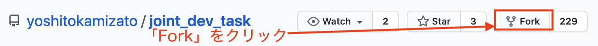
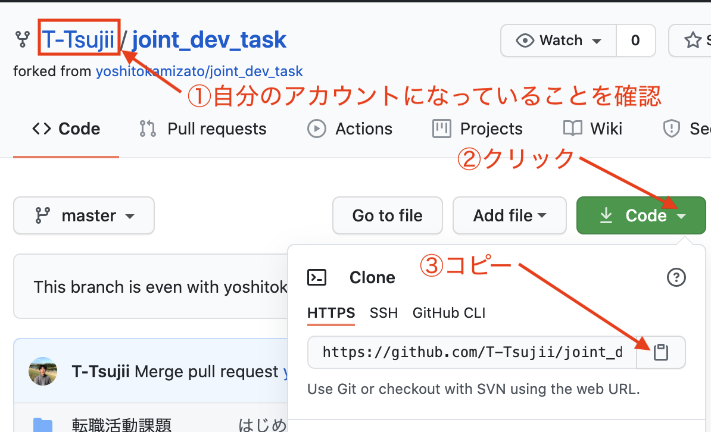
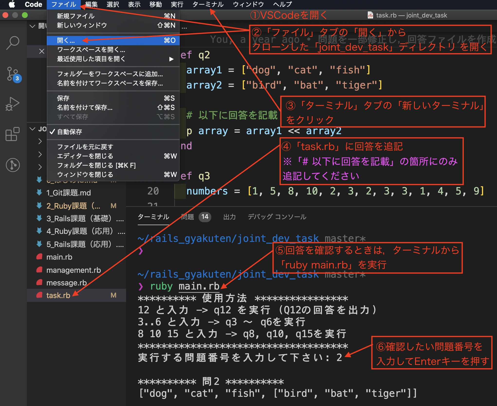

# やんばるエキスパート Ruby 課題（基礎）
Rubyの基礎力を高めることがプログラマーとしての生産性を高めてくれます。

現場に入った時にコードをスラスラ書くためにも，スラスラ読み解くためにも，ぜひ問題をこなして基礎力を磨いていって下さい。

## 教材のご案内

- [逆転教材の動画](https://www.yanbaru-code.com/movies)
  - Rubyで使用する主なクラスについて 〜 ハッシュについて
- [逆転教材のテキスト教材](https://www.yanbaru-code.com/)
  - プログラミングを学習するための基礎知識
  - 入出力を行うためのメソッド一覧 〜 ハッシュ

## 回答方法について

- 回答用のファイルを用意しております。下記リポジトリを Fork してから clone してご利用下さい。

1. [課題リポジトリ](https://github.com/yoshitokamizato/joint_dev_task) にアクセス
2. 「Fork」をクリック



3. リポジトリのURLをコピー



4. ターミナルで（作業ディレクトリまで移動してから） `git clone コピーしたURL` を実行

- 課題の回答は `task.rb` をご利用下さい。
- 出力を確認する際は，`ruby main.rb` をターミナルから実行して下さい。
  - 実行する問題番号として，例えば`3`を入力しますと，`q3`メソッドが実行される仕組みです。



## 提出方法について

- 数問解かれましたら，GitHubにプッシュし，Slackの「課題提出」チャンネルに連絡下さい
  - クローンをした時点で，プッシュ先のリポジトリがGitに登録されています。`git init`, `git remote add ~~~`は不要です
  - 問題には「積み上げ要素」があり，早めにコードレビューを受けて軌道修正した方が効率がよくなります。全て解いてからのレビュー依頼は控えていただきたいと思います。

## 回答する際の注意点

- 提出前に出力を確認し，問題に対して回答できているかを確認して下さい。
- ターミナルに出力するメソッドに「p メソッド」と「puts メソッド」があります。出力内容に応じて，使い分けて下さい。
- Rubyには便利なメソッドが豊富に用意されています。「この操作を実現できるメソッドはないかな？」と検索するクセを付けて下さい。
- 可読性を高めるため，インデント幅にも気を付けるようにして下さい。

## Q1. 次の配列の最後に "斎藤" を追加した配列を出力して下さい。

ヒント：検索キーワードは「ruby 配列　要素を追加」

```
names = ["田中", "佐藤", "佐々木", "高橋"]
```

## Q2. 次の二つの配列を合体させた新しい配列 `array` を作成し，出力して下さい。

ヒント：検索キーワードは「ruby 配列　結合」

```
array1 = ["dog", "cat", "fish"]
array2 = ["bird", "bat", "tiger"]
```

## Q3. 次の配列の中に `3` がいくつあるかを出力するコードを書き，出力して下さい。

ヒント：検索キーワードは「ruby 配列 要素 数える」

```
numbers = [1, 5, 8, 10, 2, 3, 2, 3, 3, 1, 4, 5, 9]
```

## Q4. 次の配列から `nil` の要素を削除し，出力して下さい。（新しい配列を作成せずに実現して下さい）

ヒント：「破壊的メソッド」

```
sports = ["サッカー", "フットサル", nil, "野球", "バスケ", nil, "バレー"]
```

## Q5. 配列が空であれば `true`，1つ以上の要素があれば `false` を出力するコードを書いて下さい。

例

```
array1 = []
# 実行結果
true

array2 = [1, 5, 8, 10]
# 実行結果
false
```

## Q6. 次の配列から，期待された結果の配列 `numbers2` を作成し，出力して下さい。

```
numbers1 = [1, 2, 3, 4, 5]
```

期待する配列

```
[10, 20, 30, 40, 50]
```

## Q7. 次の配列の要素を `文字列` から `数字` に変換し，出力して下さい。（新しい配列を作成せずに実現して下さい）

```
array = ["1", "2", "3", "4", "5"]
```

期待する配列

```
[1, 2, 3, 4, 5]
```

## Q8. 期待する出力結果になるようにコードを書き加えて下さい。

```
programming_languages = %w(ruby php python javascript)

# コードを追加

# 以下は変更しないで下さい
p programming_languages
p upper_case_programming_languages
```

期待する出力結果

```
["Ruby", "Php", "Python", "Javascript"]
["RUBY", "PHP", "PYTHON", "JAVASCRIPT"]
```

## Q9. 次の配列を用いて，期待通りの出力結果になるようにコードを書いて下さい。

```
names = ["田中", "佐藤", "佐々木", "高橋"]
```

期待結果

```
会員No.1 田中さん
会員No.2 佐藤さん
会員No.3 佐々木さん
会員No.4 高橋さん
```

## Q10. 次の配列の各要素について， `うに` という文字列が含まれていれば「好物です」と表示し，そうでなければ「まぁまぁ好きです」と出力するコードを書いて下さい。

```
foods = %w(いか たこ うに しゃけ うにぎり うに軍艦 うに丼)
```

## Q11. 次の配列を用いて，期待する出力結果になるようにコードを書いて下さい。

```
sports = ["サッカー", "バスケ", "野球", ["フットサル", "野球"], "水泳", "ハンドボール", ["卓球", "サッカー", "ボルダリング"]]
```

期待する出力結果

```
ユーザーの趣味一覧
No1 サッカー
No2 バスケ
No3 野球
No4 フットサル
No5 水泳
No6 ハンドボール
No7 卓球
No8 ボルダリング
```

## Q12. 次のハッシュから `name` の値を出力して下さい。

```
data = { user: { name: "satou", age: 33 } }
```

## Q13. 次の `user_data` に，`update_data` の内容を反映させ，`user_data` の内容を書き換え，出力して下さい。

```
user_data = { name: "神里", age: 31, address: "埼玉" }
update_data = { age: 32, address: "沖縄" }
```

## Q14. 次のハッシュから全てのキーを取り出した配列を作成し，出力して下さい。

```
data = { name: "satou", age: 33, address: "saitama", hobby: "soccer", email: "hoge@fuga.com" }
```

## Q15. `age` というキーが含まれている場合は `OK` ，含まれていない場合は `NG` という文字列が出力されるコードを書いて下さい。

例

```
data1 = { name: "saitou", hobby: "soccer", age: 33, role: "admin" }
# 実行結果
OK

data2 = { name: "yamada", hobby: "baseball", role: "normal" }
# 実行結果
NG
```

## Q16. 次の配列の各要素について，「私の名前は〜です。年齢は〜歳です。」と表示して下さい。

```
users = [
  { name: "satou", age: 22 },
  { name: "yamada", age: 12 },
  { name: "takahashi", age: 32 },
  { name: "nakamura", age: 41 }
]
```
