# やんばるエキスパート Rails 課題（応用）

## 注意点

- 課題を１つ完了する度に提出して下さい。
  - 課題5以降は，レビューを受けてOKが出てから次に進むようにして下さい

- データベースは `PostgreSQL` を指定して進めて下さい。

- 指示通りブランチを変更し，プルリクを出し，（マージはせずに）レビュー依頼をお願いします
  - レビュー依頼の際は，「プルリクのURL」を添えるようにして下さい。

- 必ず「指定した動作確認」を行った上でレビュー依頼を行うようにして下さい。

---

## ■ Rails 課題3

### 課題3 参考教材

まずはこちらを一通り学習されてから課題に取り組まれることをお勧めします。

- [Lv.26：エラー解決できる人材になるための7つのステップ](https://www.yanbaru-code.com/movies?page=2)

- [(やんばるエキスパート教材)デバッグツール（binding.pry）の使い方](https://www.yanbaru-code.com/texts/265)

- [【YouTube】（バグ取り解説・その1）NoMethodError](https://www.youtube.com/watch?v=aLw627JQRhk)

- [【YouTube】（バグ取り解説・その2）フォームの routing error](https://www.youtube.com/watch?v=fFH3oyMkVWM)

### 課題3 内容

以下のリンクに記載した「デバッグ課題」を解いて下さい。

[Rails 課題3のリポジトリはこちら](https://github.com/yanbaru-expert/debug_shop_app)

---

## ■ Rails 課題4

https://github.com/yanbaru-expert/pagination_app


### 課題4 参考教材

まずはこちらを一通り学習されてから課題に取り組まれることをお勧めします。

- [【やんばるエキスパート教材】メッセージ投稿アプリ（その1・CRUD処理）](https://www.yanbaru-code.com/texts/269)
- [【やんばるエキスパート教材】メッセージ投稿アプリ（その2・エラー処理）](https://www.yanbaru-code.com/texts/270)
- [【やんばるエキスパート教材】検索機能](https://www.yanbaru-code.com/texts/221)

### 課題4 内容

次のような「投稿アプリ」を実装して下さい。

- `string` 型の `body` カラムをもつ `posts` テーブル と モデル を作成
  - マイグレーションファイルの `body` カラムには `null: false` を追加してからマイグレーションを実行
  - モデルには，空文字が入らないようにバリデーションを入れること
- `rails db:seed` で50件の初期データが入るようなプログラムを書く
- 「投稿一覧ページ」の条件
  - トップページ ([http://localhost:3000](http://localhost:3000)) を「投稿一覧ページ」とする
  - 「新しい投稿が上，古い投稿が下」となるように並べる
  - 10件ごとのページネーションを実装
- 「新規投稿機能」の条件
  - 「新規投稿フォーム」は「投稿一覧ページ」の一番上に配置
  - 「新規投稿ページ」を別に作成しないこと
  - テキストフィールドを「入力必須」にすること（フロント側で対処）
  - 投稿後は「トップページ」にリダイレクト

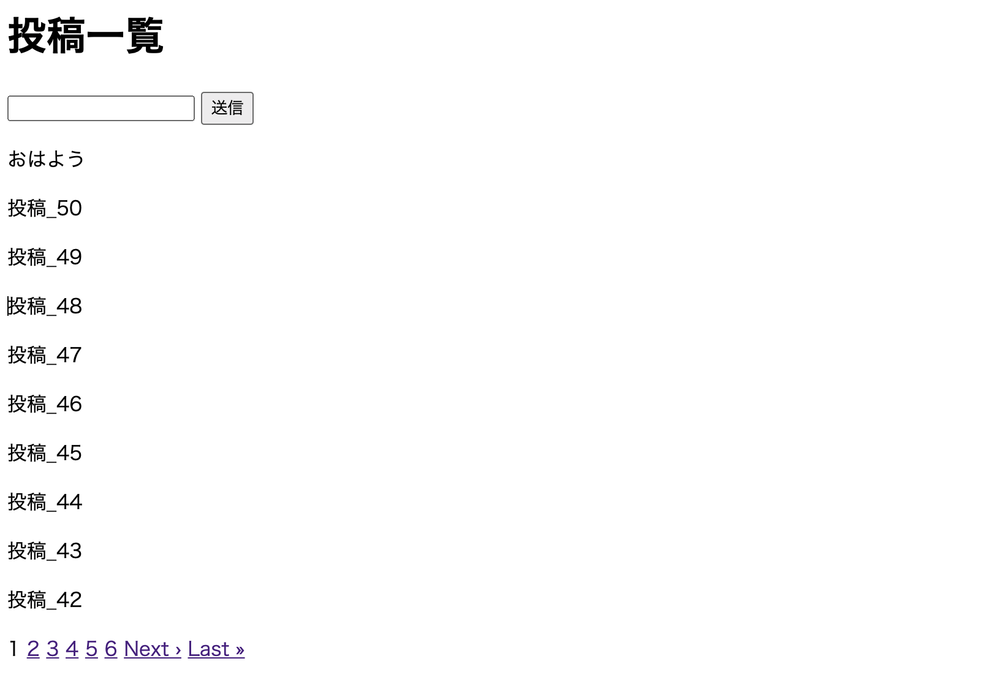

### 課題4 手順

- 以下のコマンドでアプリの準備を行う（`--minimal` はアプリを最小構成にするオプションです）

```zsh:ターミナル
rails new pagination_app -d postgresql --minimal -T
cd pagination_app
rails db:create
git add .
git commit -m init
```

- `GitHub` に新規リポジトリを作成し，プッシュし，ブランチを変更

```zsh
git remote add origin リポジトリのURL
git push origin HEAD
git switch -c task
# git branch でブランチ名が task に変更されていることを確認すること
```

- `.gitignore` に `.DS_Store`, `/vendor/bundle` を追加して次を実行

```
git add .
git commit -m ".gitignore に .DS_Store と /vendor/bundle を追加"
```

- モデルとマイグレーションファイルを作成

```
rails g model Post body:string
```

- 作成されたマイグレーションファイルの `t.string :body` に `null: false` を追加してから以下を実行

```
rails db:migrate
git add .
git commit -m "Postモデルを作成"
```

- コントローラとビューファイルを作成

```
rails g controller posts index create --skip-assets --skip-helper --skip-routes
rm -f app/views/posts/create.html.erb
git add .
git commit -m "posts コントローラとビューファイルを作成"
```

- ルーティングを次の形式で設定

```rb
Rails.application.routes.draw do
  root 'posts#index'
  resources :posts, only: :create
end
```

以下の機能を順に実装していきましょう

- `body` カラムが「空文字」で保存できないようにバリデーションを追加
- `db/seeds.rb` に50件の初期データが入るようにプログラムを書く
  - 初期データの内容は自由です。 `faker` を使用しても使用しなくてもOK
- `rails db:seed` を実行
- 投稿一覧ページで，投稿の一覧を表示できるようにする
  - 「新しい投稿が上，古い投稿が下」となるように並べる点に注意
  - 投稿は `p` タグで並べて下さい。 `table` タグを使用する必要はありません
  - 一覧表示に `each` を使わず「[コレクションをレンダリング](https://railsguides.jp/layouts_and_rendering.html#%E3%82%B3%E3%83%AC%E3%82%AF%E3%82%B7%E3%83%A7%E3%83%B3%E3%82%92%E3%83%AC%E3%83%B3%E3%83%80%E3%83%AA%E3%83%B3%E3%82%B0%E3%81%99%E3%82%8B)」を利用しましょう
  - Railsサーバーを起動して動作確認


- ページネーションを実装
  - 【参考】「検索機能(Ransack)」の「ページネーション」
  - `10件` ずつ表示にすること
  - （検索機能は不要です）

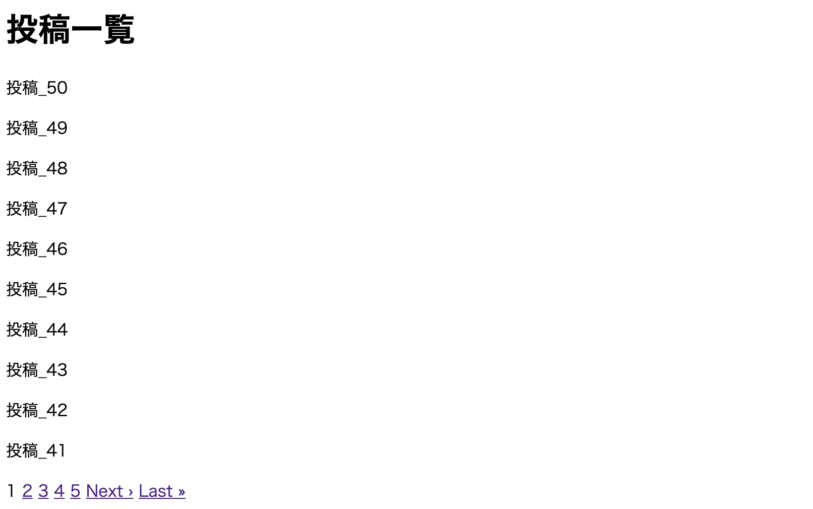

- 新規投稿フォームを実装
  - 投稿一覧ページ一番上に配置
  - 新しくページを作らないこと
  - 空文字投稿できないように「フロント側」で対処（課題3を参考に）

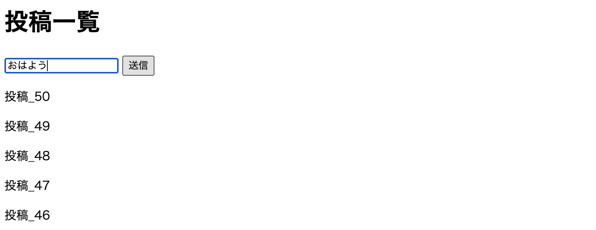
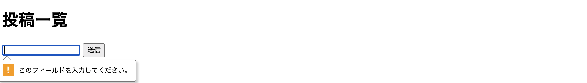

- 新規投稿できるようにする
  - `create!` を使用
  - （正常な操作ならバリデーションエラーは発生しないため，レンダリングは不要です）
  - [ストロングパラメータ](https://railsguides.jp/action_controller_overview.html#strong-parameters)を使用すること
  - 投稿後は「トップページ」にリダイレクト

- 下記の動作確認後，GitHubにプッシュし，プルリクを出し，（マージはせずに）レビュー依頼を行う
  - レビュー依頼の際は，「プルリクのURL」を添えるようにして下さい。

- レビュー後に修正があった場合は，taskブランチのまま作業を行い，add, commit, push を行い，再度レビュー依頼を行って下さい
  - 再レビュー依頼の際に，プルリクを新しく作り直す必要はありません。同じ「プルリクのURL」を添えて下さい。

- レビューが通った後は，プルリクをマージし，main(もしくは master)ブランチに移動してプルしてから次の課題に進んで下さい

### 課題4 動作確認

- 表示数が最大10件で，ページネーションが入っていること
- 新規投稿機能が動作すること
- 空文字投稿ができないこと
- 新しい投稿が上にくること
- `body` カラムにバリデーションが入っていること

### 課題4 補足

- フラッシュ・エラーメッセージの表示機能は不要です

- CSS は不要です

- `app/views/posts/index.html.erb` が次の形式となるように整理しましょう。

```erb
<h1>投稿一覧</h1>
<%= render "form" %>
<%= render @posts %>
<%= paginate @posts %>
```

---

## ■ Rails 課題5

ここからの課題で，最終的に「お勧め料理投稿アプリ」を実装していきましょう！

（CSSは課題に含めないこととします）

### 課題5 参考教材

まずはこちらを一通り学習されてから課題に取り組まれることをお勧めします。

- [【やんばるエキスパート教材】RuboCop（静的コード解析ツール）](https://www.yanbaru-code.com/texts/339)
- [【やんばるエキスパート教材】ログイン機能](https://www.yanbaru-code.com/texts/219)

### 課題5 内容

次の条件で「ユーザーのログイン機能」を実装して下さい。

- デバッグ用の gem を追加
- `RuboCop` を導入
- `devise` をインストール
- `User` のログイン機能を実装
  - パスワード再設定機能は削ること
- 初期データを作成
- 全ページをログイン必須とする
- 全ページに，ログイン時は「アカウント編集」「ログアウト」，ログアウト時は「ログイン」「アカウント登録」へのリンクを付ける
- `rails-i18n`, `devise-i18n` をインストールし，ログインページを日本語化

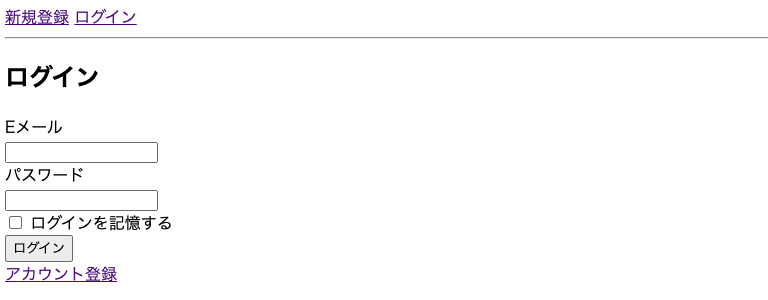

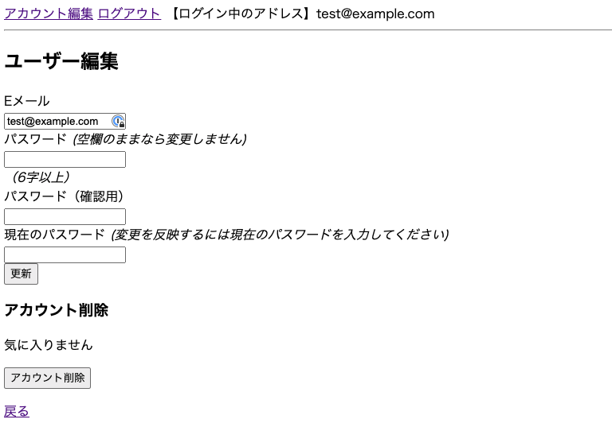

### 課題5 手順

- 以下のコマンドでアプリの準備を行う

```zsh:ターミナル
rails new recommended_food_app -d postgresql -CT --skip-active-storage

cd recommended_food_app
rails db:create
git add .
git commit -m init
```

- `GitHub` に新規リポジトリを作成し，プッシュし，ブランチを変更

```zsh
git remote add origin リポジトリのURL
git push origin HEAD
git switch -c task-5
# git branch でブランチ名が task-5 に変更されていることを確認すること
```

- `.gitignore` に `.DS_Store`, `/vendor/bundle` を追加して次を実行

```
git add .
git commit -m ".gitignore に .DS_Store と /vendor/bundle を追加"

touch config/initializers/generators.rb
```

- 作成した `generators.rb` に以下を追加

```rb
Rails.application.config.generators do |g|
  g.skip_routes true
  g.assets false
  g.helper false
end
```

```
git add .
git commit -m "rails g controller コマンドで作成されるファイルを制限"
```

- `Gemfile` に以下を追加

```rb
group :development, :test do
  gem 'byebug', platforms: [:mri, :mingw, :x64_mingw]
  # 次の3つを追加
  gem 'pry-byebug'
  gem 'pry-rails'
  gem 'pry-doc'
end
```

```
bundle install
git add .
git commit -m "debug ツールを導入"
```

以下，適度にコミットをするようにして下さい。

- 以下の教材の（2.1〜2.2）を参考に `RuboCop` を導入
  - https://www.yanbaru-code.com/texts/339
  - `VSCode` を使用されている場合は `3. VSCode で RuboCop を使用` も実行することをお勧めします 
  - 細かい設定は自由です（以下は追加することをお勧めします）

```yml
Rails/FilePath:
  Exclude:
    - 'config/environments/development.rb'

Rails/Output:
  Exclude:
    - 'db/seeds.rb'
```

【注意】 今後，コミットをする前に `bundle exec rubocop -a` を実行しておくこと

- ログイン機能の実装
  - `Gemfile` に `devise` を追加してインストール
  - 以下を実行

```
rails g devise:install
rails g devise User
```

- （マイグレーションの実行前に！）マイグレーションファイルのパスワード再設定関連のカラムをコメントアウト

```
# 次の箇所をコメントアウト

      ## Recoverable
      t.string   :reset_password_token
      t.datetime :reset_password_sent_at

# 次の箇所をコメントアウト

    add_index :users, :reset_password_token, unique: true
```

- パスワード再設定機能を削るため， `User` モデルの `:recoverable` を削除

- マイグレーションを実行

- 初期データを追加し， `rails db:seed` を実行
  - レビュー側も使用しますので，メールアドレス・パスワードは以下でお願いします

```rb
User.create!(email: "test@example.com", password: "password")
puts "ユーザーの初期データインポートに成功しました。"
```

- 全ページをログイン必須とする

`app/controllers/application_controller.rb` に `before_action :authenticate_user!` を追加

- 全ページに，ログイン時は「アカウント編集」「ログアウト」「ログインしているユーザーのメールアドレス」，ログアウト時は「ログイン」「アカウント登録」へのリンクが付くようにする

- ログインページの日本語化
  - `rails g devise:i18n:views` は実行しないで下さい

【注意】教材の「商品の登録機能」以降の内容は，今回の課題と関係がありません

- 下記の動作確認後，GitHubにプッシュし，プルリクを出し，（マージはせずに）レビュー依頼を行う
  - レビュー依頼の際は，「プルリクのURL」を添えるようにして下さい。

- レビュー後に修正があった場合は， `task-5` ブランチのまま作業を行い，add, commit, push を行い，再度レビュー依頼を行って下さい
  - 再レビュー依頼の際に，プルリクを新しく作り直す必要はありません。同じ「プルリクのURL」を添えて下さい。

- レビューが通った後は，プルリクをマージし，main(もしくは master)ブランチに移動してプルしてから次の課題に進んで下さい

### 課題5 動作確認

- 新規登録・ログイン・ログアウト・アカウント編集機能の動作確認
  - http://localhost:3000/users/sign_in にアクセスすると，「新規登録・ログイン」のリンクが表示されること
  - 「パスワードを忘れましたか?」のリンクが存在しないこと
  - ログインすると `Yay! You're on Rails!` の画面が表示されること
  - ログインのページ http://localhost:3000/users/sign_in にアクセスしても戻されること
  - アカウント編集ページ http://localhost:3000/users/edit にアクセスすると，「アカウント編集」「ログアウト」のリンクが表示されること
  - ログアウトすると `Yay! You're on Rails!` の画面が表示されること
- 上記ページが日本語化されていることを確認
- `app/controllers/application_controller.rb` に `before_action :authenticate_user!` が追加されていること
- `bundle exec rubocop -a` を実行しても差分がないこと
  - もし差分があればコミットしておくこと

---

## ■ Rails 課題6

### 課題6 参考教材

まずはこちらを一通り学習されてから課題に取り組まれることをお勧めします。

- [【やんばるエキスパート教材】モデルの関連付け その1（1対多）](https://www.yanbaru-code.com/texts/296)

### 課題6 内容

課題5で作成したアプリに，次の条件で「お勧め料理のCRUD処理」を追加実装して下さい。

- 外部キー `user_id`, `string` 型の `name` カラム, `text` 型の `comment` カラムをもつ `foods` テーブルを作成
  - 後で「画像」も投稿できるようにしますが，この課題の時点では考えなくて結構です
  - `name` には `NOT NULL` 制約を入れ，空文字禁止のバリデーションを入れること
  - `comment` はバリデーション無しでOK
  - モデル・カラムの日本語設定を追加
- `User` モデルと `Food` モデルを関連付ける
  - `dependent: :destroy` の入れ忘れに注意
- ログイン時のヘッダーに「一覧ページ」「新規投稿ページ」へのリンクを追加
- 投稿したユーザーの情報(user_id)を含む料理のCRUD機能を実装
  - トップページは，一覧ページとすること
  - フォームは，料理名（`name`）は `text_field`，コメント（`comment`）は `text_area` を使用すること
  - 料理名（`name`）はフロント側で「入力必須」にすること（コメントは入力必須ではない）
  - 一覧ページには，各投稿に対して「投稿者のメールアドレス」「料理名(name)」と「詳細・編集・削除」のリンクを表示
  - 詳細ページには，「投稿者のメールアドレス」「料理名(name)」「コメント」と「編集・削除・投稿一覧」のリンクを表示（「作成日時」は不要です。「コメント」は改行が反映されるように `simple_format`, `h` ヘルパーメソッドを使用すること）
  - 他人の投稿を更新・削除できないようにすること。
  - 一覧・詳細ページで本人以外の投稿で「編集」「削除」のリンクが表示されないようにすること

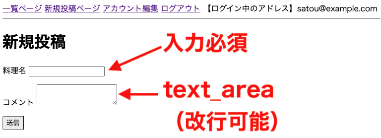

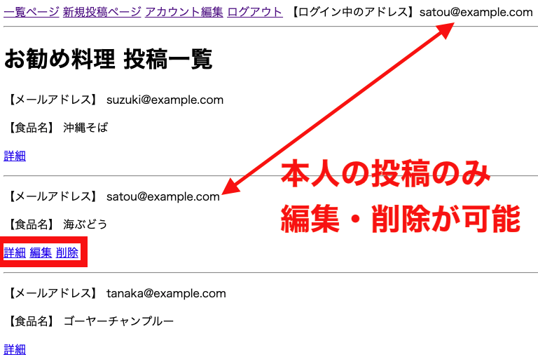

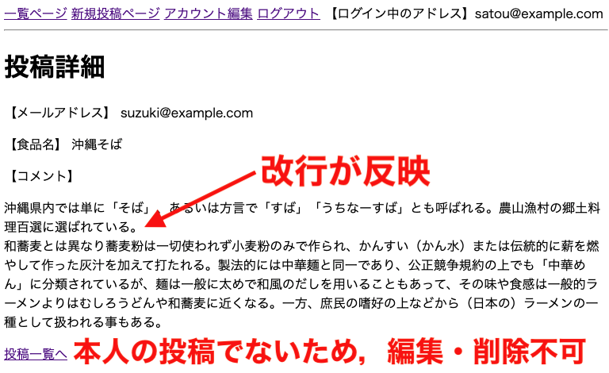

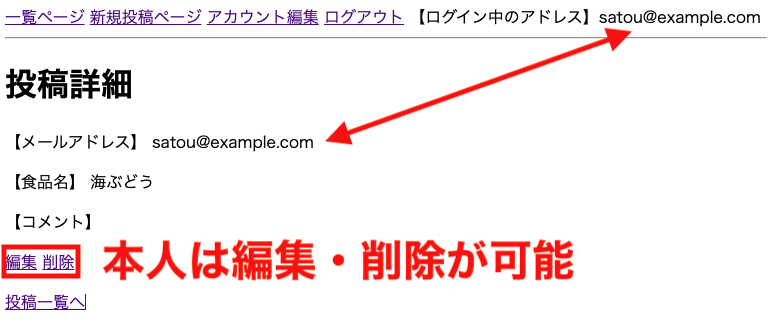

### 課題6 手順

【注意】課題5のプルリクをマージしていない場合はマージし，main(もしくは master)ブランチに移動してプルして下さい。念のため，Rails サーバーを起動し，課題5の機能が反映されていることを確認して下さい。

- ブランチが main(もしくは master)ブランチ であることを確認した上で， `task-6` ブランチを作成して切り替える

- 「モデルの関連付け その1」教材の「2. メッセージのCRUD機能」以降を参考に進めて下さい。

- 下記の動作確認後，GitHubにプッシュし，プルリクを出し，（マージはせずに）レビュー依頼を行う
  - レビュー依頼の際は，「プルリクのURL」を添えるようにして下さい。

- レビューが通った後は，プルリクをマージし，main(もしくは master)ブランチに移動してプルしてから次の課題に進んで下さい

### 課題6 動作確認

- 以下を確認

```zsh
rails db

# PostgreSQL に接続後
\d foods

# name カラムに NOT NULL 制約が入っていることを確認後
exit

rails c -s

# Railsコンソール起動後

Food.model_name.human
#=> "料理"
Food.human_attribute_name(:comment)
#=> "コメント"
Food.create!
#=> ActiveRecord::RecordInvalid: バリデーションに失敗しました: ユーザーを入力してください, 料理名を入力してください

# 以下でエラーが出ないことを確認
User.destroy_all
user = User.create!(email: "test@example.com", password: "password")
user.foods.create!(name: "沖縄そば", comment: "コメントです")
user.destroy!
```

- ログイン時のヘッダーのリンクを確認
  - リンクが正常に機能しているかどうかも確認すること
- 一覧表示・詳細表示・新規投稿・更新・削除機能の確認
  - 「料理名」は空投稿ができないこと
  - 複数行のコメントを投稿した際に，詳細ページで改行が反映されていること
  - 画像を確認し，表示すべき内容を確認すること
- 他人の投稿の更新・削除ができないことを確認
- `bundle exec rubocop -a` を実行しても差分がないこと
  - もし差分があればコミットしておくこと

---

## ■ Rails 課題7

### 課題7 参考教材

まずはこちらを一通り学習されてから課題に取り組まれることをお勧めします。

- [【やんばるエキスパート教材】画像投稿機能（CarrierWave）](https://www.yanbaru-code.com/texts/222)

### 課題7 内容

課題6で作成したアプリに，次の条件で投稿機能に「お勧め料理の画像」を添付できるようにして下さい。

- `foods` テーブルに，画像ファイル名を保存する `string` 型の `image` カラムを追加
  - 新しいマイグレーションファイルを作成して対応すること
  - 既存のマイグレーションファイルを修正しないこと
  - 画像の添付は必須としない
- `carrierwave` で新規投稿・更新フォームから画像も投稿できるように変更
  - `.gitignore` への追記を忘れないこと
  - 画像ファイル形式のバリデーションを入れること(jpg, gif, png)
  - 画像ファイルサイズのバリデーションを入れること(5MBまで)
  - デフォルト画像は不要
  - ファイル名をランダムに変更すること
  - 画像ファイルの加工（ファイル形式を変更・サイズを変更・サムネイル画像）などは全て不要
  - `mini_magick` の導入は不要
- 詳細ページで画像が表示されるようにする
  - 一覧ページでは表示させないこと

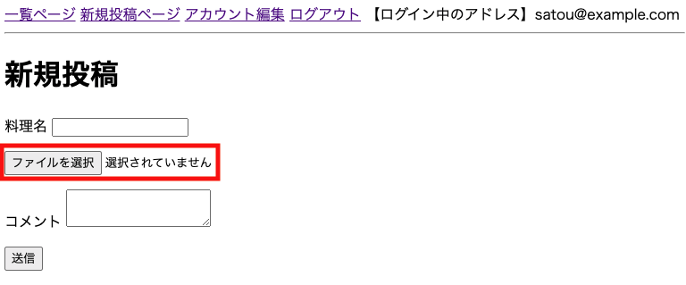


### 課題7 手順

【注意】課題6のプルリクをマージしていない場合はマージし，main(もしくは master)ブランチに移動してプルして下さい。念のため，Rails サーバーを起動し，課題6の機能が反映されていることを確認して下さい。

- ブランチが main(もしくは master)ブランチ であることを確認した上で， `task-7` ブランチを作成して切り替える

- 「画像投稿機能（CarrierWave）」教材を参考に進めて下さい。

- 下記の動作確認後，GitHubにプッシュし，プルリクを出し，（マージはせずに）レビュー依頼を行う
  - レビュー依頼の際は，「プルリクのURL」を添えるようにして下さい。

- レビューが通った後は，プルリクをマージし，main(もしくは master)ブランチに移動してプルしてから次の課題に進んで下さい

### 課題7 動作確認

- 新規投稿・編集フォームに画像を添付できること
- 詳細ページで画像が表示されること
  - 一覧ページでは表示させない
- `bundle exec rubocop -a` を実行しても差分がないこと
  - もし差分があればコミットしておくこと

---

## ■ Rails 課題8

### 課題8 参考教材

まずはこちらを一通り学習されてから課題に取り組まれることをお勧めします。

- [【やんばるエキスパート教材】モデルの関連付け その2（多対多）](https://www.yanbaru-code.com/texts/297)

### 課題8 内容

課題7で作成したアプリに，次の条件でお勧め料理投稿に「いいね機能」を実装して下さい。

- 外部キー `user_id`, `food_id` をもつ `likes` テーブルを実装
  - 適切なユニーク制約を入れること
- `User` モデル, `Food` モデルと `Like` モデルを関連づける
  - 必要なバリデーションも入れること
  - 
- 「いいね機能」用のルーティング・コントローラを作成
- 詳細表示・一覧表示に「いいね機能」を実装
  - 非同期で処理できるようにすること
  - いいね数表示は不要

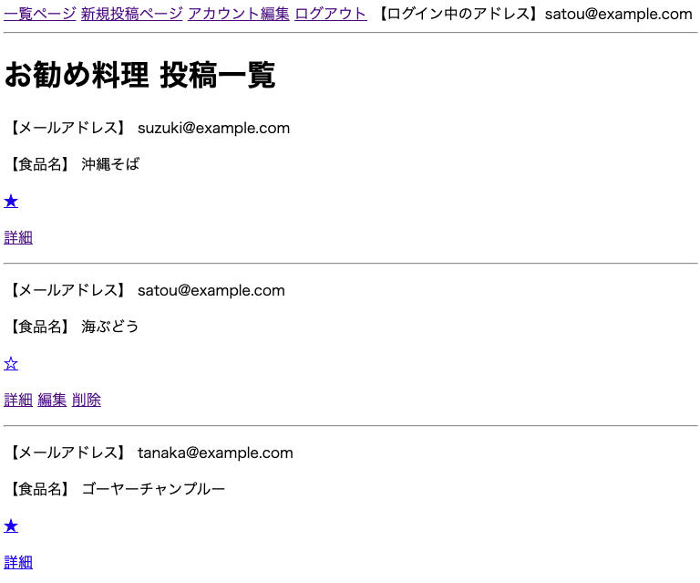

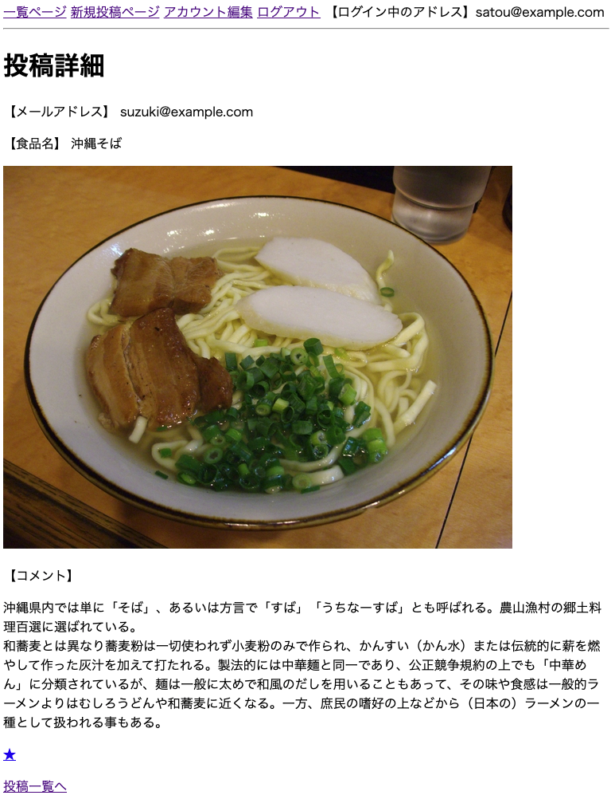

### 課題8 手順

【注意】課題7のプルリクをマージしていない場合はマージし，main(もしくは master)ブランチに移動してプルして下さい。念のため，Rails サーバーを起動し，課題7の機能が反映されていることを確認して下さい。

- ブランチが main(もしくは master)ブランチ であることを確認した上で， `task-8` ブランチを作成して切り替える

- 「モデルの関連付け その2（多対多）」教材を参考に進めて下さい。

- 下記の動作確認後，GitHubにプッシュし，プルリクを出し，（マージはせずに）レビュー依頼を行う
  - レビュー依頼の際は，「プルリクのURL」を添えるようにして下さい。

- レビューが通った後は，プルリクをマージし，main(もしくは master)ブランチに移動してプルしてから次の課題に進んで下さい

### 課題8 動作確認

- 以下を確認

```zsh
rails c -s

# Railsコンソール起動後
User.destroy_all

user = User.create!(email: "test@example.com", password: "password")
food = user.foods.create!(name: "沖縄そば", comment: "コメントです")
food2 = user.foods.create!(name: "海ぶどう")

user.likes.create!(food_id: food.id)
user.likes.create!(food_id: food2.id)

Like.count
#=> 2

food.likes.create!(user_id: user.id)
#=> ActiveRecord::RecordInvalid: バリデーションに失敗しました: Userは同じ投稿に2回以上いいねはできません

Like.create!
#=> ActiveRecord::RecordInvalid: バリデーションに失敗しました: ユーザーを入力してください, 料理を入力してください

# 次でエラーが出ないことを確認
user.destroy!

User.count
#=> 0
```

- 一覧表示・詳細表示で「いいね機能」が非同期で動作すること
- `bundle exec rubocop -a` を実行しても差分がないこと
  - もし差分があればコミットしておくこと